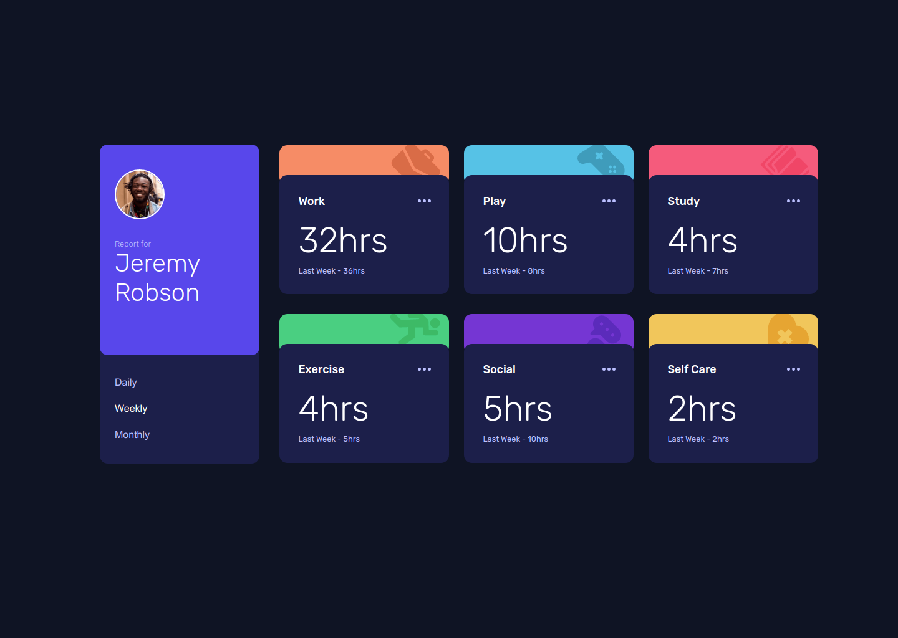

# Frontend Mentor - Time tracking dashboard solution

This is a solution to the [Time tracking dashboard challenge on Frontend Mentor](https://www.frontendmentor.io/challenges/time-tracking-dashboard-UIQ7167Jw). Frontend Mentor challenges help you improve your coding skills by building realistic projects. 

## Table of contents

- [Overview](#overview)
  - [The challenge](#the-challenge)
  - [Screenshot](#screenshot)
  - [Links](#links)
- [My process](#my-process)
  - [Built with](#built-with)
  - [What I learned](#what-i-learned)
  - [Continued development](#continued-development)
- [Author](#author)
- [Acknowledgments](#acknowledgments)

## Overview

### The challenge

Users should be able to:

- View the optimal layout for the site depending on their device's screen size
- See hover states for all interactive elements on the page
- Switch between viewing Daily, Weekly, and Monthly stats

### Screenshot

### Links

- Solution URL: [https://github.com/techanthere/time-tracking-dashboard](https://github.com/techanthere/time-tracking-dashboard)
- Live Site URL: [https://hopeful-cori-0a87b5.netlify.app/](https://hopeful-cori-0a87b5.netlify.app/)

## My process

### Built with

- Semantic HTML5 markup
- CSS custom properties
- Flexbox
- CSS Grid
- Mobile-first workflow
- Accessibility

### What I learned

Through this challenge I have learnt a lot of aspects regarding the accessibility and that how to use the aria-annotations properly. Though the data in this solution could have been dynamically picked from the JSON file but I preferred to do it otherwise, and that's because I wanted to make use of tablist in this solution. The javascript part was a bit tricky but not hard and I have also added the navigation with arrow keys. I had a great learning experience and really enjoyed working on this solution.

### Continued development

Since this challenge has a JSON file for loading data dynamically, so I intend to do it next time using the dynamic data loading. While re doing this challenge in future, I will be planning on how can I achieve the accessibility with a little change in the HTML structure. 

## Author

- Frontend Mentor - [@techanthere](https://www.frontendmentor.io/profile/techanthere)
- Twitter - [@techanthere](https://www.twitter.com/techanthere)

## Acknowledgments

I am very grateful to community on the Frontend Mentor, Matt, and Grace who is a Workspace Admin on Frontend Mentor Slack Channel. Their reviews have been really helpful throughout my work on the challenges.